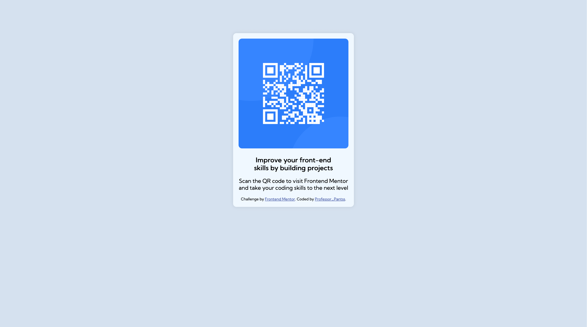

# Frontend Mentor - QR code component solution

## Table of contents

- [Overview]
- [Screenshot]
- [My process]
- [Built with]
- [What I learned]
- [Continued development]

## Overview

### Screenshot

## My process

I started with creating the component card as the parent and the contents inside as the child components such as the QR code and descriptions.

### Built with

- Semantic HTML5 markup
- Flexbox
- Mobile-first workflow

### What I learned

- Images are flexible for both desktop and mobile devices when width of 100% is used instead of px. This prevents them from being distorted and misaligned when the screen sizes change.
